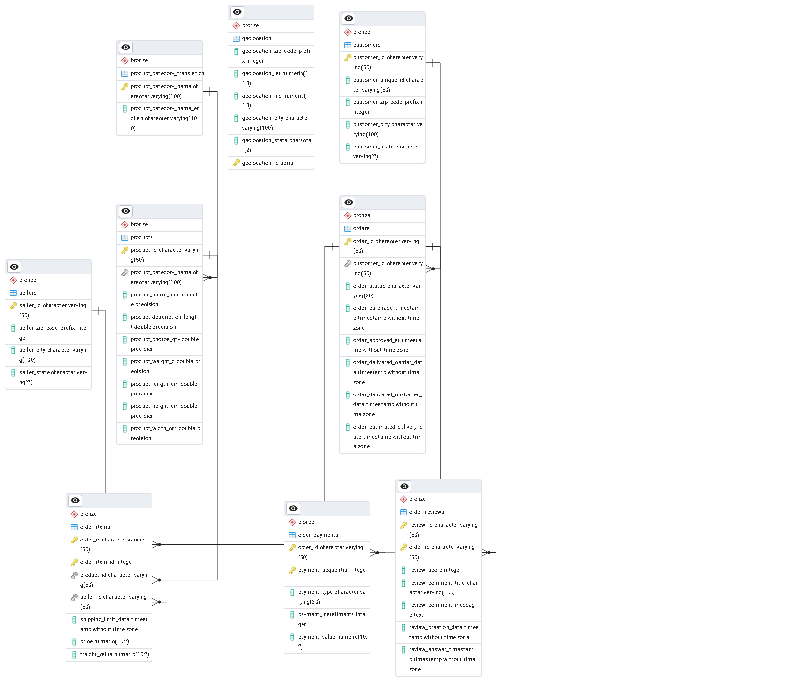

# Olist E-commerce Data Analysis

This project focuses on the comprehensive analysis of the Olist e-commerce dataset. It involves an Extract, Transform, Load (ETL) pipeline to ingest and structure the data, followed by database schema design for analytical querying, and finally, data visualization to uncover insights into customer behavior, sales trends, and product performance.

## Table of Contents

- [Project Overview](#project-overview)
- [Data Source](#data-source)
- [Project Structure](#project-structure)
- [Database Design](#database-design)
- [Data Visualization](#data-visualization)
- [Tech Stack](#tech-stack)
- [Prerequisites](#prerequisites)
- [Installation and Setup](#installation-and-setup)
- [Usage Guide](#usage-guide)
  - [ETL Process](#etl-process)
  - [SQL Scripts Execution](#sql-scripts-execution)
  - [Accessing Analytical Views](#accessing-analytical-views)
- [Contributing](#contributing)
- [License](#license)

## Project Overview

The primary goal of this project is to process, store, and analyze the Olist e-commerce dataset to derive actionable insights.

Key areas of analysis and project features include:
-   Ingestion of raw e-commerce data from multiple CSV files.
-   Establishment of a relational database with a structured schema (Bronze, Silver, Gold layers).
-   Application of data integrity constraints (primary and foreign keys).
-   Creation of analytical views to facilitate business intelligence and reporting.
-   Visualization of key metrics and trends through interactive dashboards.
-   Potential areas for insights: customer segmentation, sales performance over time, product category popularity, order processing efficiency, and geographical sales distribution.

## Data Source

The dataset is the publicly available Olist E-commerce dataset, which contains anonymized information about orders, products, customers, sellers, payments, and reviews from a Brazilian e-commerce platform. The raw data is provided in CSV format and typically located in a path like `data/raw/archive (1)/` within the project structure.

## Project Structure

The repository is typically organized as follows:
```
olist_ecommerce_analysis/
|-- data/raw/archive (1)/ # Contains the raw Olist CSV datasets
|-- docs/images/ # Suggested folder for ERD and dashboard images
|   |-- final_erd.png
|   |-- Screenshot 2025-05-14 222202.png
|   |-- Screenshot 2025-05-14 222238.png
|-- notebooks/ # Jupyter notebooks for experimentation, connection testing, and potentially analysis
|   |-- db_connection.ipynb
|   |-- extract.ipynb
|   |-- load.ipynb
|   |-- main.ipynb
|-- sql/ # SQL scripts for database schema, table creation, constraints, and views
|   |-- 00_create_schemas.sql
|   |-- 01_create_bronze_tables.sql
|   |-- 02_apply_constraints.sql
|   |-- 03_create_analytical_views.sql
|   |-- 04_misc_data_checks_and_exports.sql
|-- src/ # Python source code for the ETL pipeline and database utilities
|   |-- db_utils.py
|   |-- etl_pipeline.py
|   |-- extract_data.py
|   |-- load_data.py
|-- .gitignore
|-- README.md # This file
|-- requirements.txt # Python dependencies
```

## Database Design

We use PostgreSQL as our relational database, organized into Bronze, Silver, and Gold schemas to represent different data processing stages.

### Database ERD

Below is the Entity Relationship Diagram (ERD) illustrating the table structures and relationships:

****
*(Ensure the image `final_erd.png` is placed in `docs/images/` or update the path.)*

The SQL scripts in the `sql/` directory define the database structure:
* `00_create_schemas.sql`: Creates bronze, silver, and gold schemas.
* `01_create_bronze_tables.sql`: Creates tables in the bronze schema for raw data.
* `02_apply_constraints.sql`: Applies primary and foreign key constraints.
* `03_create_analytical_views.sql`: Creates views in the gold schema for analysis.

## Data Visualization

Interactive dashboards provide insights into various aspects of the e-commerce data. These are typically built using tools like Tableau Public, connecting to the analytical views in the Gold schema.

### Sales Performance Dashboard

**[ADD IMAGE HERE: Sales Dashboard - `docs/images/sales_dashboard.png`]**
*(Ensure the image, e.g., `Screenshot 2025-05-14 222202.png`, is renamed and placed in `docs/images/` or update the path.)*

This dashboard visualizes:
* Overall sales metrics
* Regional sales distribution
* Product category performance
* Order volume trends

### Customer Analysis Dashboard

**[ADD IMAGE HERE: Customer Analysis Dashboard - `docs/images/customer_dashboard.png`]**
*(Ensure the image, e.g., `Screenshot 2025-05-14 222238.png`, is renamed and placed in `docs/images/` or update the path.)*

This dashboard focuses on:
* Customer demographics
* Order patterns and frequency
* Customer satisfaction
* Geographic customer distribution

## Tech Stack

* **Programming Language:** Python 3.x
* **Data Manipulation:** Pandas, NumPy
* **Database:** PostgreSQL
* **Database Connector (Python):** `psycopg2-binary`, `SQLAlchemy`
* **Environment Management:** `python-dotenv`
* **Notebooks:** Jupyter Notebooks (`ipykernel`, `nbformat`)
* **Data Visualization (Example):** Tableau Public, Matplotlib, Seaborn
* **SQL:** For database schema and queries.

## Prerequisites

* Python (3.8 or higher recommended)
* `pip` (Python package installer)
* PostgreSQL server (12 or higher recommended) installed and running.
* A SQL client tool (e.g., `psql`, pgAdmin, DBeaver).

## Installation and Setup

1.  **Clone the repository:**
    ```bash
    git clone [https://github.com/](https://github.com/)[YourGitHubUsername]/[YourRepositoryName].git
    cd [YourRepositoryName]
    ```

2.  **Create and activate a Python virtual environment (recommended):**
    ```bash
    python -m venv venv
    # On Windows
    venv\Scripts\activate
    # On macOS/Linux
    source venv/bin/activate
    ```

3.  **Install Python dependencies:**
    ```bash
    pip install -r requirements.txt
    ```

4.  **Set up PostgreSQL Database:**
    * Create a new PostgreSQL database (e.g., `olist_db`).
    * Create a PostgreSQL user with privileges to create schemas and tables in this database.

5.  **Configure Database Connection:**
    * Create a `.env` file in the project's root directory.
    * Add your database connection details to the `.env` file. The `src/db_utils.py` script expects:
        ```env
        DB_HOST=your_db_host
        DB_NAME=your_db_name
        DB_USER=your_db_user
        DB_PASS=your_db_password
        DB_PORT=your_db_port # e.g., 5432
        ```

6.  **Initialize Database Schema and Tables:**
    * Execute the SQL scripts in the `sql/` directory against your PostgreSQL database **in the specified order**:
        1.  `00_create_schemas.sql`
        2.  `01_create_bronze_tables.sql`
        3.  `02_apply_constraints.sql`
    * You can use `psql` or any SQL client. Example with `psql`:
        ```bash
        psql -h your_host -U your_user -d your_database -f sql/00_create_schemas.sql
        psql -h your_host -U your_user -d your_database -f sql/01_create_bronze_tables.sql
        # ... and so on for other scripts.
        ```

## Usage Guide

### 1. ETL Process (Load Raw Data to Bronze Schema)

This process extracts data from CSV files and loads it into the `bronze` schema tables in PostgreSQL.

* Ensure your database is set up and the `.env` file is configured correctly.
* Run the main ETL pipeline script:
    ```bash
    python src/etl_pipeline.py
    ```
    This script uses `src/extract_data.py` for reading CSVs and `src/load_data.py` (with `src/db_utils.py`) for loading data into bronze tables.
* Alternatively, you can explore and run steps interactively using the Jupyter Notebooks in the `notebooks/` directory (e.g., `main.ipynb`).

### 2. SQL Scripts Execution (Post-ETL)

After the initial ETL, run the remaining SQL scripts sequentially:

* **`02_apply_constraints.sql` (if not run during setup):**
    * **Purpose:** Adds primary and foreign key constraints to `bronze` tables.
    * **Execution:** Run after bronze tables are populated.
* **`03_create_analytical_views.sql`:**
    * **Purpose:** Creates analytical views in the `gold` schema. These views join and transform data for easier analysis and are intended as data sources for dashboards.
    * **Execution:** Run after bronze tables are populated and constraints are applied.
* **`04_misc_data_checks_and_exports.sql`:**
    * **Purpose:** Contains queries for data validation, exploration, or exporting data subsets (e.g., to CSV for Tableau).
    * **Execution:** Run as needed. Note that `\copy` commands are specific to `psql`.

### 3. Accessing Analytical Views

Once the ETL and `03_create_analytical_views.sql` script have run, the `gold` schema will contain views ready for analysis. Connect to your PostgreSQL database using any SQL client or BI tool (like Tableau) to query these views.

## Contributing

Contributions are welcome! Please follow these steps:
1.  Fork the repository.
2.  Create a new branch (`git checkout -b feature/your-feature-name`).
3.  Make your changes and commit them (`git commit -m 'Add some feature'`).
4.  Push to the branch (`git push origin feature/your-feature-name`).
5.  Open a Pull Request.

Please ensure your code adheres to existing styles and update documentation as needed.

## License

This project is licensed under the **[Specify License Here - e.g., MIT License]**.

Please include the full text of your chosen license in a `LICENSE` file in the root of the project. For example, if using the MIT License:


Copyright (c) [Year] [Your Name/Organization]

Permission is hereby granted, free of charge, to any person obtaining a copy
of this software and associated documentation files (the "Software"), to deal
in the Software without restriction, including without limitation the rights
to use, copy, modify, merge, publish, distribute, sublicense, and/or sell
copies of the Software, and to permit persons to whom the Software is
furnished to do so, subject to the following conditions:

The above copyright notice and this permission notice shall be included in all
copies or substantial portions of the Software.

THE SOFTWARE IS PROVIDED "AS IS", WITHOUT WARRANTY OF ANY KIND, EXPRESS OR
IMPLIED, INCLUDING BUT NOT LIMITED TO THE WARRANTIES OF MERCHANTABILITY,
FITNESS FOR A PARTICULAR PURPOSE AND NONINFRINGEMENT. IN NO EVENT SHALL THE
AUTHORS OR COPYRIGHT HOLDERS BE LIABLE FOR ANY CLAIM, DAMAGES OR OTHER
LIABILITY, WHETHER IN AN ACTION OF CONTRACT,
