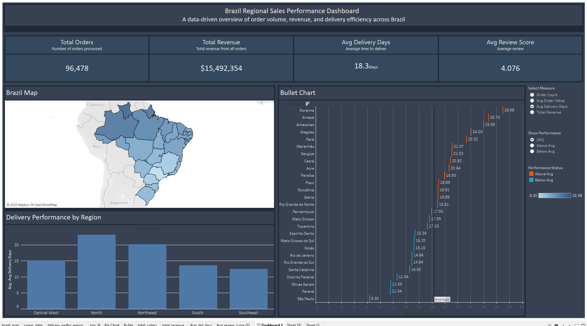
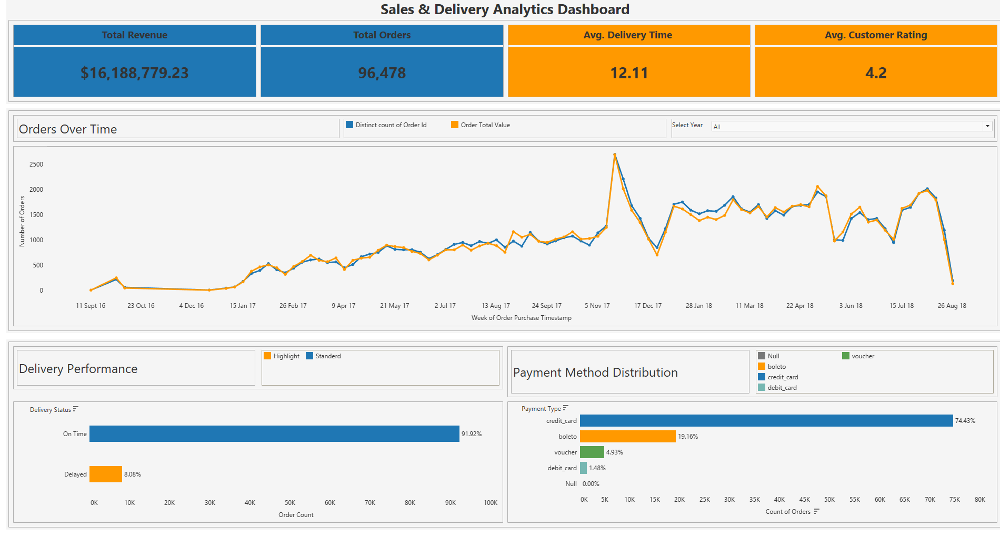

# Olist E-commerce Data Analysis

This project focuses on the comprehensive analysis of the Olist e-commerce dataset. It involves an Extract, Transform, Load (ETL) pipeline to ingest and structure the data, followed by database schema design for analytical querying, and finally, data visualization to uncover insights into customer behavior, sales trends, and product performance.

## Table of Contents

- [Project Overview](#project-overview)
- [Data Source](#data-source)
- [Project Structure](#project-structure)
- [Database Design](#database-design)
- [Data Visualization](#data-visualization)
- [Tech Stack](#tech-stack)
- [Prerequisites](#prerequisites)
- [Installation and Setup](#installation-and-setup)
- [Usage Guide](#usage-guide)
  - [ETL Process](#etl-process)
  - [SQL Scripts Execution](#sql-scripts-execution)
  - [Accessing Analytical Views](#accessing-analytical-views)
- [Contributing](#contributing)
- [License](#license)

## Project Overview

The primary goal of this project is to process, store, and analyze the Olist e-commerce dataset to derive actionable insights.

Key areas of analysis and project features include:
-   Ingestion of raw e-commerce data from multiple CSV files.
-   Establishment of a relational database with a structured schema (Bronze, Silver, Gold layers).
-   Application of data integrity constraints (primary and foreign keys).
-   Creation of analytical views to facilitate business intelligence and reporting.
-   Visualization of key metrics and trends through interactive dashboards.
-   Potential areas for insights: customer segmentation, sales performance over time, product category popularity, order processing efficiency, and geographical sales distribution.

## Data Source

The dataset is the publicly available Olist E-commerce dataset, which contains anonymized information about orders, products, customers, sellers, payments, and reviews from a Brazilian e-commerce platform. The raw data is provided in CSV format and typically located in a path like `data/raw/archive (1)/` within the project structure.

## Project Structure

The repository is typically organized as follows:

olist_ecommerce_analysis/
|-- data/raw/archive (1)/ # Contains the raw Olist CSV datasets
|-- docs/images/ # Suggested folder for ERD and dashboard images
|   |-- final_erd.png
|   |-- Screenshot 2025-05-14 222202.png
|   |-- Screenshot 2025-05-14 222238.png
|-- notebooks/ # Jupyter notebooks for experimentation, connection testing, and potentially analysis
|   |-- db_connection.ipynb
|   |-- extract.ipynb
|   |-- load.ipynb
|   |-- main.ipynb
|-- sql/ # SQL scripts for database schema, table creation, constraints, and views
|   |-- 00_create_schemas.sql
|   |-- 01_create_bronze_tables.sql
|   |-- 02_apply_constraints.sql
|   |-- 03_create_analytical_views.sql
|   |-- 04_misc_data_checks_and_exports.sql
|-- src/ # Python source code for the ETL pipeline and database utilities
|   |-- db_utils.py
|   |-- etl_pipeline.py
|   |-- extract_data.py
|   |-- load_data.py
|-- .gitignore
|-- README.md # This file
|-- requirements.txt # Python dependencies
## Database Design

A relational database (PostgreSQL) is used to store and manage the data. The database is structured with Bronze, Silver, and Gold schemas, representing different stages of data processing and refinement.

An Entity Relationship Diagram (ERD) illustrating the table structures and relationships for the core tables is available.

*(Ensure the image `final_erd.png` is placed in the path specified below, or update the path if it's different. Consider renaming image files to remove spaces/special characters.)*

```markdown

The SQL scripts in the sql/ directory define the schemas, tables, and relationships:00_create_schemas.sql: Creates bronze, silver, and gold schemas.01_create_bronze_tables.sql: Creates tables in the bronze schema to hold raw data from CSVs.02_apply_constraints.sql: Applies primary and foreign key constraints to tables in the bronze schema.03_create_analytical_views.sql: Creates views in the gold schema for easier analysis and dashboarding.Data VisualizationInteractive dashboards have been created using Tableau Public to visualize key findings and trends from the analyzed data. Below are previews and links to the live dashboards.(Ensure the screenshot images are placed in the specified paths, or update them if different. You might also consider renaming the image files to avoid spaces and special characters, e.g., dashboard_preview_1.png and dashboard_preview_2.png.)[Dashboard 1 Title - e.g., Olist Sales Performance Overview]Description: [Briefly describe what this dashboard shows, e.g., overall sales trends, regional performance, and product category analysis.]Live Dashboard Link: [Link to your first Tableau Public Dashboard]Preview:
[Dashboard 2 Title - e.g., Olist Customer and Order Analysis]Description: [Briefly describe what this dashboard shows, e.g., customer demographics, order patterns, and review score distributions.]Live Dashboard Link: [Link to your second Tableau Public Dashboard]Preview:
Tech StackProgramming Language: Python 3.xData Manipulation: Pandas, NumPyDatabase: PostgreSQLDatabase Connector (Python): psycopg2-binary, SQLAlchemyEnvironment Management: python-dotenvNotebooks: Jupyter Notebooks (ipykernel, nbformat)Data Visualization: Tableau Public, Matplotlib, Seaborn (for ad-hoc plotting in notebooks)SQL: For database schema, queries, and views.PrerequisitesPython (version 3.8 or higher recommended)pip (Python package installer)PostgreSQL server (version 12 or higher recommended) installed and running.A tool to execute SQL scripts against PostgreSQL (e.g., psql command-line tool, pgAdmin, DBeaver).Installation and SetupClone the repository:git clone https://github.com/[Your GitHub Username]/[Your Repository Name].git
cd [Your Repository Name]
Create and activate a Python virtual environment (recommended):python -m venv venv
# On Windows
venv\Scripts\activate
# On macOS/Linux
source venv/bin/activate
Install Python dependencies:pip install -r requirements.txt
Set up PostgreSQL Database:Create a new PostgreSQL database (e.g., olist_db).Create a PostgreSQL user with privileges to create schemas and tables in this database.Configure Database Connection:Create a .env file in the root directory of the project.Add your database connection details to the .env file. The src/db_utils.py script expects the following variables:DB_HOST=your_db_host
DB_NAME=your_db_name
DB_USER=your_db_user
DB_PASS=your_db_password
DB_PORT=your_db_port # e.g., 5432
Ensure these variables are correctly set for the scripts to connect to your database.Initialize Database Schema and Tables:Execute the SQL scripts located in the sql/ directory against your PostgreSQL database in the specified order. This can be done using psql or any SQL client connected to your database.00_create_schemas.sql01_create_bronze_tables.sql02_apply_constraints.sqlRefer to the SQL Scripts Execution section for more details on their purpose.Usage GuideETL ProcessThe core ETL process involves extracting data from CSV files and loading it into the bronze schema tables in the PostgreSQL database.Ensure the database is set up and connection is configured as per the Installation and Setup section.Run the main ETL pipeline script:The primary script for the initial ETL (extracting from CSVs and loading to bronze tables) is src/etl_pipeline.py.python src/etl_pipeline.py
This script utilizes src/extract_data.py to read CSVs and src/load_data.py along with src/db_utils.py to load data into the respective bronze tables.Alternatively, parts of this process or the entire orchestration might be available in notebooks/main.ipynb or other specific notebooks. Review the notebooks for interactive execution steps.SQL Scripts ExecutionThe SQL scripts in the sql/ folder are designed to be run sequentially to set up and populate the database structure for analysis.00_create_schemas.sql:Purpose: Creates the bronze, silver, and gold schemas.Execution: Run this script first to establish the data warehousing layers.01_create_bronze_tables.sql:Purpose: Defines the table structures within the bronze schema, mirroring the columns of the source CSV files.Execution: Run after creating schemas. These tables will be populated by the Python ETL process.02_apply_constraints.sql:Purpose: Adds primary key and foreign key constraints to the tables in the bronze schema to ensure data integrity and define relationships.Execution: Run after the bronze tables have been created and populated with initial data.03_create_analytical_views.sql:Purpose: Creates views in the gold schema. These views often involve joins, aggregations, and transformations on data from the bronze (or potentially silver) schema to provide data in a ready-to-analyze format for business intelligence tools and direct querying.Execution: Run after bronze tables are populated and constraints are applied. These views are intended to be the primary source for Tableau dashboards.04_misc_data_checks_and_exports.sql:Purpose: Contains various SELECT queries for data validation, ad-hoc exploration, or exporting specific data subsets.Execution: Can be run as needed for data checks after various stages.To execute these scripts using psql:psql -h your_host -U your_user -d your_database -f path/to/script.sql
Replace your_host, your_user, and your_database with appropriate values.Accessing Analytical ViewsOnce the ETL process has run and the 03_create_analytical_views.sql script has been executed, the gold schema will contain views ready for analysis.These views can be queried directly using any SQL client connected to the PostgreSQL database. They also serve as the data sources for the Tableau dashboards mentioned in the Data Visualization section.ContributingContributions to this project are welcome. To contribute:Fork the repository.Create a new branch for your feature or bug fix:git checkout -b feature/your-feature-name
Make your changes and commit them with clear, descriptive messages.Push your changes to your forked repository:git push origin feature/your-feature-name
Create a Pull Request against the main repository, detailing the changes made.Please ensure that any new code adheres to existing styling and that relevant documentation is updated.LicenseThis project is licensed under the [Specify License Here - e.g., MIT License].Please include the full text of your chosen license in a LICENSE file in the root of the project. For example, if using MIT License:MIT License

Copyright (c) [Year] [Your Name/Organization]

Permission is hereby granted, free of charge, to any person obtaining a copy
of this software and associated documentation files (the "Software"), to deal
in the Software without restriction, including without limitation the rights
to use, copy, modify, merge, publish, distribute, sublicense, and/or sell
copies of the Software, and to permit persons to whom the Software is
furnished to do so, subject to the following conditions:

The above copyright notice and this permission notice shall be included in all
copies or substantial portions of the Software.

THE SOFTWARE IS PROVIDED "AS IS", WITHOUT WARRANTY OF ANY KIND, EXPRESS OR
IMPLIED, INCLUDING BUT NOT LIMITED TO THE WARRANTIES OF MERCHANTABILITY,
FITNESS FOR A PARTICULAR PURPOSE AND NONINFRINGEMENT. IN NO EVENT SHALL THE
AUTHORS OR COPYRIGHT HOLDERS BE LIABLE FOR ANY CLAIM, DAMAGES OR OTHER
LIABILITY, WHETHER IN AN ACTION OF CONTRACT,
